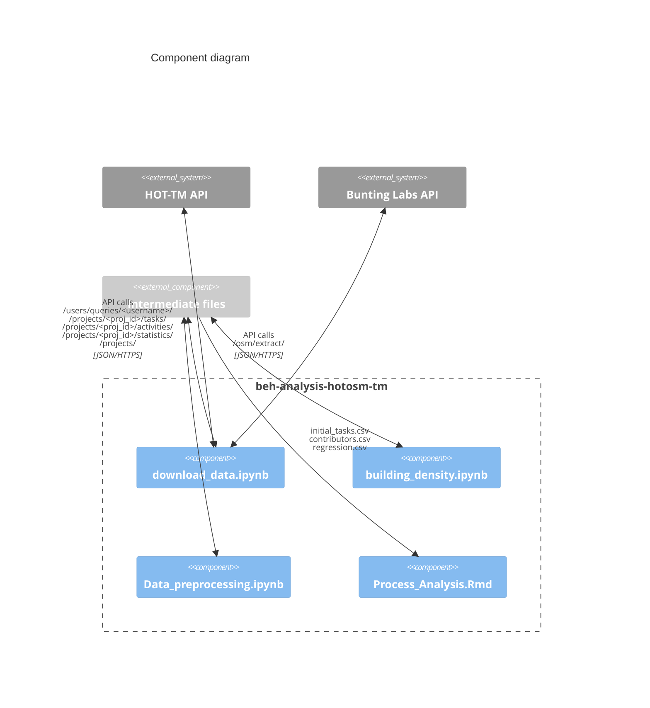
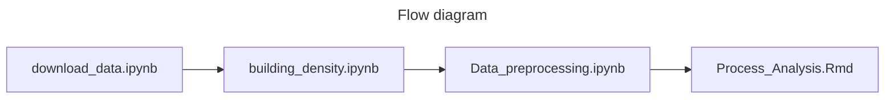

# beh-analysis-hotosm-tm

## Description
The following image represents a Component Diagram showing how the code for the project is organised. Blue boxes represent the internal code components, which are Jupyter (IPython) and R notebooks, while dark gray boxes represent external systems, APIs from where the data is retrieved, and the light gray box represents the file system where the intermediate data files are shared between the different internal components.

The steps required to execute the internal components are shown in the flow diagram.

All tables and figures included in the paper “Process Analysis in Humanitarian Voluntary Geographic Information: the case of the HOT Tasking Manager” can be found in the R Notebook (“Process_Analysis.Rmd”) or their versions in HTML or PDF.

## Runtime
To execute Jupyter Notebooks appropriate Python IDEs should be used (e.g. JupyterLab, PyCharm, or Google Colab) and for R Notebooks R Studio is required. This code was designed and executed in the following environments:

### Jupyter Notebooks
* Google Colab release 2023-11-27 (Colab Pro high RAM runtime needed for building_density.ipynb in a few HOT projects with a big area, the regular free runtime is good for every other case)
* Python 3.10.12
*pandas 1.5.3
* geopandas 0.13.2
* numpy 1.25.2
* requests 2.31.0
* json 2.0.9
* IPython 7.34.0
* ipywidgets 7.7.1
* tqdm 4.66.1
* utm 0.7.0

### R Notebook
Program
* R Studio (Version 2023.09.1+494) which depends on R version 4.3.2.
  
Hardware
* Macbook Air, Processor: 1.6 GHz dual-core Intel Core i5, Memory: 8GB 2133MHz LPDDR3

R packages and versions
* bupaverse 0.1.0
* reshape2 1.4.4
* gt 0.10.1
* scales 1.3.0
* readr 2.1.4
* dplyr 1.1.4
* magrittr 2.0.3
* ggplot2 3.4.4
* Hmisc 5.1-1
* gamlss 5.4-20

## License
[GPL-3.0 license](LICENSE)

## Acknowledgements
This project has received funding from the European Union’s Horizon 2020 research and innovation programme under the Marie Skłodowska-Curie grant agreement No 955569.
The opinions expressed in this document reflect only the author’s view and in no way reflect the European Commission’s opinions. The European Commission is not responsible for any use that may be made of the information it contains.
