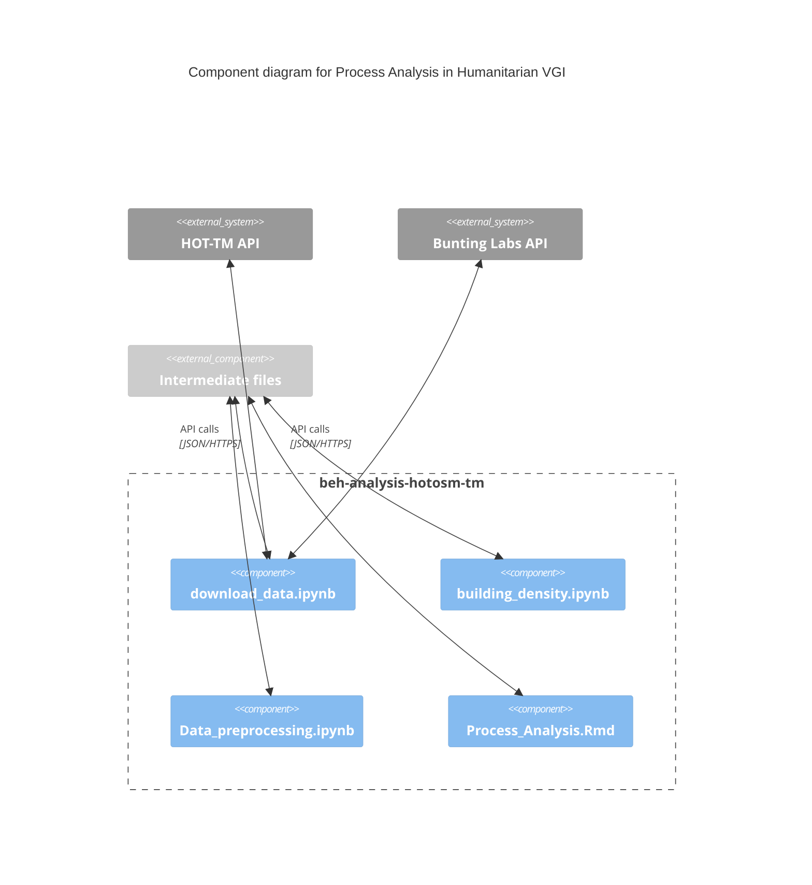

# beh-analysis-hotosm-tm

This project has received funding from the European Union’s Horizon 2020 research and innovation programme under the Marie Skłodowska-Curie grant agreement No 955569.
The opinions expressed in this document reflect only the author’s view and in no way reflect the European Commission’s opinions. The European Commission is not responsible for any use that may be made of the information it contains.
